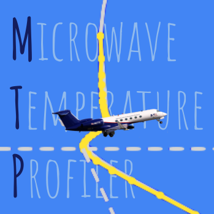

```
CAUTION: When running the MTP instrument, if Tsynth under the Engineering tab
gets to 50 degreesC, the probe needs to be shutdown to avoid overheating
```
# Microwave Temperature Profiler Instrument Control, Real-Time Display and Processing Software

The Microwave Temperature Profiler (MTP) is a HAIS instrument which was developed by JPL for the NSF/NCAR GV.

The [original VB6 code base](https://github.com/NCAR/MTP-VB6) from JPL that supports data processing and display was written in Microsoft Visual Basic 6. Since Microsoft has chosen to depracate Visual Basic, RAF has embarked on a re-write of some components of the original code. This repository contains those rewrites.

Packages needed to run the MTP software are documented in mtpenv.yml

## To install (on MAC/LINUX/Windows10)

Make sure you have installed at least python 3.7
Use miniconda to install all needed packages:
 * Download conda from https://conda.io/miniconda.html and install
   * Update conda if warned following instructions
 * Install Git (if not already there) and download MTP:
   * https://git-scm.com/ -> Download latest per automatic OS detection. Run .exe file to install. I used default settings as suggested by installer, except that I asked to install a desktop icon for “Git Bash”
 * If installing on eol-ale or eol-atom, set up the EOL Jenkins user to download software from github
   * Create C:\Users\lroot\.gitconfig containing
```
[user]
        name = eolJenkins
```
   * Create C:\Users\lroot\.git-credentials containing the eoljenkins git credential - either login to github as user jenkins to get it, or copy it from the other MTP laptop.
```
https://eoljenkins:<long credential string here>@github.com
```
 * Launch “Git Bash”
 * From /c/Users/lroot in git bash
```
    git clone http://github.com/NCAR/MTP
```
   The first time you may need to cancel out of a window asking for credentials before the download will start.
 * Create the MTP conda environment from the YAML env file
```
   > conda env create -f mtpenv.yml
```
 * If the yaml file doesn't work because it can't resolve conflicts, you can install by hand:
```
   > conda create --name mtp
```
   then activate and conda install each package individually. Note that metpy is only available from the conda-force channel.
 * Activate the mtp conda environment - see - https://conda.io/activation
```
   > conda init bash
   > conda activate mtp
```
 * Install the EOL-Python packages per instructions in https://github.com/NCAR/EOL-Python
 
## Optional on Windows10

 * Add Miniconda3 and Miniconda3\condabin to your path
   * Windows search -> type "env" -> click "Edit the system environment variables"
   * In lower "System variables" window, click the "Path" row and click edit
   * Click "New" and add the new paths, e.g.
     * C:\Users\lroot\Miniconda3
     * C:\Users\lroot\Miniconda3\condabin
     * C:\Users\lroot\Miniconda3\Scripts
     * C:\Users\lroot\Miniconda3\Library\bin

If the packages are not available via the conda-forge channel, you can search for alternative channels at https://anaconda.org

Change you environment variable and add a PYTHONPATH that points to the netCDF installation (You will also add the path to EOL-Python to this env var below.)

### Configure the MTPviewer software
 * Create shortcuts to the bat files in the windows10 dir and put them on the Desktop
 * Edit the bat file and correct the python path if needed
 * Add --config=path\to\config\file for project you are going to run.
 * If you want to run the IWGemulator, install aircraft_nc_utils
```
    > git clone http://github.com/NCAR/aircraft_nc_utils
```

Install the EOL-Python packages per instructions in https://github.com/NCAR/EOL-Python

Check your PYTHONPATH
```
    > echo %PYTHONPATH%
```
It should contain a path to EOL-Python and a path to the anaconda site-packages.
If it doesn't follow the instructions on the EOL-Python page.

## To operate the MTP from Windows10

You only need to do this if you will be connecting your computer directly to the MTP instrument in the lab or on the aircraft. If you are only running MTPviewer to monitor collected data, you don't need to install the driver.

 * Install the driver for the USOPTL4 USB to serial converter
 * Download the driver from https://support.advantech.com/support/DownloadSRDetail_New.aspx?SR_ID=1-HIPU-30&Doc_Source=Download 

 * Extract the zip file to the desktop
 * Run C:\Documents and Settings\mtp\Desktop\USB_Drivers_PKG_v2-08-28\BBSmartWorx\Windows\dpinst64
 * Plug in the USB cable from the MTP to the laptop
 * Go to the device manager and change the port to comm 6
   * This PC -> right click -> manage -> device manager -> Other Devices or COM & PORT (I think) -> USOPTL4
 * Comfirm port settings as 9600|8|None|1|None

Information on operating the MTP, and other documentation, can be found on the (UCAR SEW MTP wiki)[https://wiki.ucar.edu/display/SEW/MicrowaveTemperatureProfiler]

## To run this code:
Both src\ctrl\view.py and src\MTPviewer.py reference a project configuration directory with the following components:
```
  <project>\
    config\
      ascii_parms (used to parse IWG packet, copied from RAF proj dir for project)
      config.Mtph
      proj.yml
      Production\
        setup_rf##.yml - one per flight, used for post-processing
    logs\
    RC\ - contains project RCF files
```
 * Create/update config/proj.yml
 * cd src
 * On Windows10:
 ```
 * click on MTPviewer icon on the desktop. If this is not available:
     > conda activate (to get the base environment where libraries have been installed)
     > C:\Users\lroot\Miniconda3\python.exe MTPviewer.py --config=path\to\config\fie

 ```
 * On a MAC:
 ```
 > python3 MTPviewer.py --config=\path\to\config\file
 ```
** NOTE that on a MAC you will use python3, but on Windows it's python.exe (no 3) **

## To run in test mode, generate fake "real-time" data by running

 * On Windows10:
 ```
 * Click on MTPemulator icon on the desktop. If this is not available:
    > conda activate
    > cd C:\Users\lroot\MTP\src\emulator
    > C:\Users\lroot\Miniconda3\python.exe snd_MTP_udp.py

 * Click on IWGemulator icon on the desktop. If this is not available:
    > git clone http://github.com/NCAR/aircraft_nc2iwg1
    > conda activate
    > cd C:\Users\lroot\MTP\Data\NGV\DEEPWAVE\NG
    > C:\Users\lroot\Miniconda3\python.exe C:\Users\lroot\aircraft_nc2iwg1\nc2iwg1.py -s 1 -u True -er True DEEPWAVERF01.nc

 ```
 * On a MAC:
 ```
> cd MTP/src/emulator
> python3 snd_MTP_udp.py
> ./snd_IWG.sh  (need to install http://github.com/NCAR/aircraft_nc2iwg1)
```
* Then run the GUI in real-time mode, using the platform-specific python call, e.g. on Windows:
```
>python MTPviewer.py --config=\path\to\config\file
```

## Developer Notes

### Documentation

For complete documentation on each class/method, useful if you need to modify the code, use pydoc to extract embedded documentation from each file:

* On a MAC: (Change python3 to python for Windows)
```
> cd src
> python3 -m pydoc <filename>
e.g. python3 -m pydoc lib/rwget.py
```

### Unit tests

If the unittests are all run sequentially from the same command (python3 -m unittest discover -s ../tests -v), earlier tests seem to leave the unittest code in a state that causes subsequent tests to fail. An attempt was made to get each test to clean up after itself by adding setUp and tearDown functions. But Python's unittest holds on to all sorts of memory until the entire test suite has been run. For a good explanation see: https://stackoverflow.com/questions/26915115/unittest-teardown-del-all-attributes/35001389

To get around this, a shell script has been written that breaks up the test suite into smaller chunks. To manually run all unittests, use this script:

* On a MAC: (Change python3 to python for Windows) 
```
> cd src
OR
> cd tests
> ../tests/run_tests.sh
```

* On a WINDOWS10:
```
> cd src
OR
> cd tests
> powershell -noexit "& ""..\tests\run_tests_Windows.ps1"""
```
